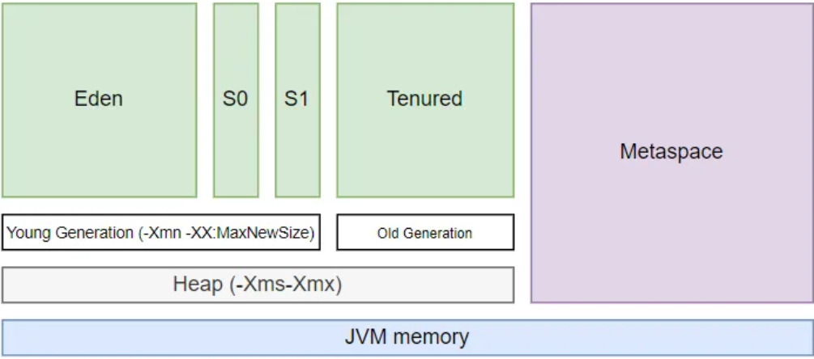

**Primitive to object and wise versa**

      Integer i = Integer.valueOf(2) : Convert Primitive to Object
      int j = i.intValue() : Convert Object to Primitive

**Overriding/Overloading Rules** [Other links](https://www.java67.com/2012/09/what-is-rules-of-overloading-and-overriding-in-java.html)

Overriding:
1. Location: A method can only be overridden in sub-class, not in the same class. If you try to create two methods with the same signature in one class compiler will complain about it saying "duplicate method in type Class"
2. Exception : if an overridden method throws IOException or ClassNotfoundException, which are checked Exception then the overriding method can not throw java.lang.Exception because it comes higher in type hierarchy (it's the superclass of IOException and ClassNotFoundExcepiton).
   1. Checked Exp is free to throw any unchecked exception. Overriding method can not throw higher exception.
   2. If Overridden method does not throws an exception then overriding method can throw unchecked exception else compile time error

3. Visibility : The overriding method can not reduce access of overridden method. It means if the overridden method is defined as public then the overriding method can not be protected or package-private.
4. Accessibility : Overriding method can increase access of overridden method. This is the opposite of the earlier rule, according to this if the overridden method is declared as protected then the overriding method can be protected or public.
5. Types of Methods : The private, static, and final methods can not be overridden in Java.
6. Return Type : The return type of overriding method must be the same as overridden method. Trying to change the return type of method in the child class will throw compile-time error "return type is incompatible with parent class method"

Overloading:
1. The overloaded and overloading methods must be in the same class (Note: this includes any methods inherited, even implicitly, from a superclass).
2. The method parameters must change: either the number or the type of parameters must be different in the two methods.
3. The return type can be freely modified.
4. The access modifier (public, private, and so on) can be freely modified.
5. Thrown exceptions, if any, can be freely modified.

**MethodReference**: refers method of FI. It is compact and easy form of Lambda Expression.
1. Reference to static method
2. Reference to instance method
3. Reference to a constructor

``` 
Function<String,Integer> parseInt = s -> Integer.parseInt(s);
Function<String,Integer> parseInt = Integer::parseInt;
```
[Java 8 to 17 exmaple](https://reflectoring.io/java-release-notes/#java-module-system)

### Java 9

**Try-with-resources** : Try-with-resources is a feature that enables us to declare new autoclosable resources on a try-catch block. Declaring them inside a try-catch block tells the JVM to release them after the code has run. The only condition is that the declared resource implements an Autoclosable interface.
```
final BufferedReader br3 = new BufferedReader(new StringReader("Hello world example3!"));
        try (BufferedReader reader = br3) {
            System.out.println(reader.readLine());
        } catch (IOException e) {
            System.out.println("Error happened!");
        }
```

**Private Interface Methods** : How do we split the implementation into several methods? When working with classes, we can achieve it using private methods.
The main benefit of this feature inside Java 9 is better encapsulation and reusability of the code.
```
    private List<String> readNames(BufferedReader br) throws IOException {
            ArrayList<String> names = new ArrayList<>();
            String name;
            while ((name = br.readLine()) != null) {
                names.add(name);
            }
            return names;
    }
```

### Java 10

**Local Variable Type Inference** : Java always needed explicit types on local variables.The var type allows us to omit type from the left-hand side of our statements.
        
    Ex : var Roland = new Person("Roland", "Deschain");

### Java 11

**Local Variable Type in Lambda Expressions**
        
        var filteredPersons =
                List.of(Roland, Susan, Eddie, Detta, Jake)
                        .stream()
                        .filter((var x) -> x.name.contains("a"))
                        .collect(Collectors.toList());

Please note that it doesn’t make a difference if we use var or type inference without it. It will work the same for both.

### Java 14

**Switch Expressions** : Switch expressions allowed us to omit break calls inside every case block. It helps with the readability of the code and better understanding.

        Old Way: 
        Month month = Month.APRIL;
        switch (month) {
            case JANUARY, MARCH, MAY, JULY, AUGUST, OCTOBER, DECEMBER :
                days = 31;
                break;
            case FEBRUARY :
                days = 28;
                break;
            case APRIL, JUNE, SEPTEMBER, NOVEMBER :
                days = 30;
                break;
            default:
                throw new IllegalStateException();
        }
        New way: 
        int days = 0;
        Month month = Month.APRIL;

        days = switch (month) {
            case JANUARY, MARCH, MAY, JULY, AUGUST, OCTOBER, DECEMBER -> 31;
            case FEBRUARY -> 28;
            case APRIL, JUNE, SEPTEMBER, NOVEMBER -> 30;
            default -> throw new IllegalStateException();
        };
We are using a bit different notation in the case block. We are using -> instead of the colon.Even though we are not invoking the break statement, we will still jump out of the switch statement on the first valid condition.

The yield Keyword : In a multi-line code block, we have to use the yield keyword to return a value from a case block.
int days = 0;
        
        Month month = Month.APRIL;
        days = switch (month) {
            case JANUARY, MARCH, MAY, JULY, AUGUST, OCTOBER, DECEMBER -> {
                System.out.println(month);
                yield 31;
            }
            case FEBRUARY -> {
                System.out.println(month);
                yield 28;
            }
            case APRIL, JUNE, SEPTEMBER, NOVEMBER -> {
                System.out.println(month);
                yield 30;
            }
            default -> throw new IllegalStateException();
        };


### Java 15

**Text Blocks** : We used special syntax for opening and closing quotes: """. This allows us to treat our string as if we are writing it in a .txt file.

    String html = """
        <html>
            <body>
                <p>Hello World.</p>
            </body>
        </html>
    """;

### Java 16

**Pattern Matching of instanceof** : Pattern matching on the instanceof allows us to cast our variable inline and use it inside the desired if-else block without explicitly casting it.

    public static double getPerimeter(Shape shape) throws IllegalArgumentException {
        if (shape instanceof Rectangle r) {
            return 2 * r.length() + 2 * r.width();
        } else if (shape instanceof Circle c) {
            return 2 * c.radius() * Math.PI;
        } else {
            throw new IllegalArgumentException("Unrecognized shape");
        }
    }
One thing to note is the scope of the casted variable. It’s visible only within the if statement.

**Records** : Records are generate immutable properties and auto-generated methods. A record class is nothing more than regular POJO, for which most of the code is generated from the definition.
    
    public record VehicleRecord(String code, String engineType) {}

Note : One thing to note is that the record class is, by default, final, and we need to comply with that. That means we cannot extend a record class, but most other things are available for us.

### Java17

**Sealed Classes** : 

Usecase : The final modifier on a class doesn’t allow anyone to extend it. What about when we want to extend a class but only allow it for some classes?

The sealed class allows us to make class effectively final for everyone except explicitly mentioned classes.

    public sealed class Vehicle permits Bicycle, Car {...}

We added a sealed modifier to our Vehicle class, and we had to add the permits keyword with a list of classes that we allow to extend it.We need to add final, sealed, or non-sealed modifiers to classes that will extend our class.

    public final class Bicycle extends Vehicle {...}

1. Permitted subclasses must be accessible by the sealed class at compile time
2. Permitted subclasses must directly extend the sealed class
3. Permitted subclasses must have one of the following modifiers:
   1. final
   2. sealed 
   3. non-sealed
4. Permitted subclasses must be in the same Java module

### Garbage Collection

GC works in two simple steps, known as Mark and Sweep:

Mark – this is where the garbage collector identifies which pieces of memory are in use and which aren’t.

Sweep – this step removes objects identified during the “mark” phase.

There are generally four ways to make an object eligible for garbage collection.
1. Nullifying the reference variable
2. Re-assigning the reference variable
3. An object created inside the method
4. Island of Isolation

We can also request JVM to run Garbage Collector. There are two ways to do it :
1. Using System.gc() method: System class contain static method gc() for requesting JVM to run Garbage Collector.
2. Using Runtime.getRuntime().gc() method: Runtime class allows the application to interface with the JVM in which the application is running. Hence by using its gc() method, we can request JVM to run Garbage Collector.
3. There is no guarantee that any of the above two methods will run Garbage Collector. The call System.gc() is effectively equivalent to the call : Runtime.getRuntime().gc()

Just before destroying an object, Garbage Collector calls finalize() method on the object to perform cleanup activities. Once finalize() method completes, Garbage Collector destroys that object.
      
      protected void finalize() throws Throwable

[Output](https://www.geeksforgeeks.org/output-of-java-programs-set-10-garbage-collection/)
      
      String str = new String("abc");
      str = null;
      System.gc()// internally calls Runtine.getRuntime.gc().
      Thread.sleep(1000);
      if(str!=null) sop ("Object is resurrected") else ("Obj not resurrected");
      str = null; System.gc()// Finanlize object will be not called 2nd time and object will be collected directly by GC
      protected void finalize()  {
         str = new String("def");
         System.out.println("finalize method called");
         System.out.println(10/0);
      }

When Garbage Collector calls finalize() method on an object, it ignores all the exceptions raised in the method and program will terminate normally.
Since on this object, finalize() method is already called, so now Garbage Collector will destroy it without calling finalize() method again

finalize() : Deprecated in Java 9. Performance impact,Unpredictability for resurrection introduces non-deterministic behaviour.

Copy further details via note

What are the types of references and there role in Garbage collection?
1. Strong References : Prevent garbage collection
2. Weak References : Allow garbage collection when no strong references exist. 
3. Soft References : Collected only when memory is low. 
4. Phantom References : Used for post-garbage collection cleanup.

### Java Memory Module


Metaspace : Metaspace is a memory region in Java that stores static information pertaining to a Java application, including metadata associated with loaded classes. Unlike its predecessor, PermGen, Metaspace does not have an explicit size limit by default and expands dynamically. However, without an explicit boundary set, the Metaspace size is implicitly restricted by the available system memory on the hosting machine.

Heap : The heap in Java consists of dynamically allocated memory where objects are stored during the execution of a Java program. It is a region of the computer’s memory that is managed by the Java Virtual Machine (JVM). The heap is used to allocate memory for objects created using the “new” keyword, as well as for data structures such as arrays and collections.

The heap is divided into two main areas:
1. Young Generation: This area is further divided into Eden space and two Survivor spaces (From and To). Objects are initially allocated in the Eden space. When the Eden space becomes full, a minor garbage collection is triggered, and surviving objects are moved to one of the Survivor spaces. Objects that survive multiple garbage collection cycles in the Survivor spaces are eventually promoted to the Old Generation.
2. Old Generation: This area is also known as the Tenured Generation. It is used to store long-lived objects that have survived multiple garbage collection cycles in the Young Generation. Major garbage collections are performed in the Old Generation to reclaim memory from unreachable objects.

What happens in memory when use 'new' keyword?
1. Heap : The object is created in the heap. 
2. Stack : A reference to the object is stored in the stack. 
3. Constructor : Initializes the object when created. The Constructor assigns values to instance variables and performs any required setup.

### Generics : 
Use covariance (? extends T) when you need to read data.
Use contravariance (? super T) when you need to write data.

TypeErasure : Generic type information is lost at runtime; List < String> becomes List

